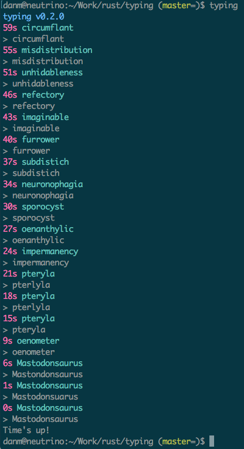

# rust-typing

Practice touch typing on the command line

# Pre-requisites

* Rust 1.19 or above https://www.rust-lang.org/en-US/install.html

# To install

Clone the project

```
git clone https://github.com/munckymagik/rust-typing
```

Then to build and install it locally:

```
cargo run
```

That will install to `~/.cargo/bin` folder, which should have been added to your path as part of installing Rust.
So run you can now just execute:

```
typing
```

# Usage Example


